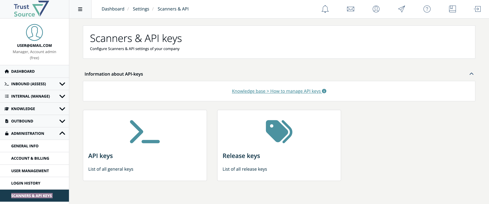
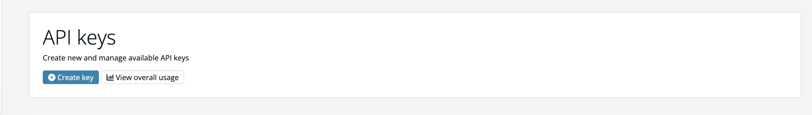
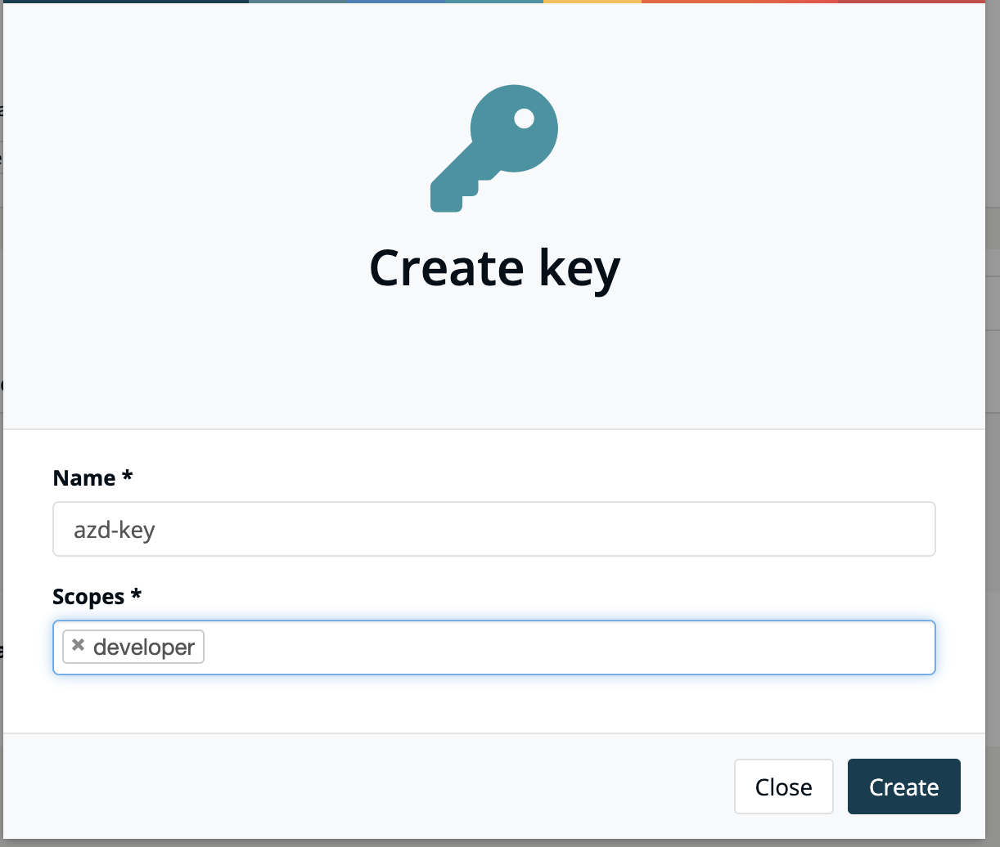
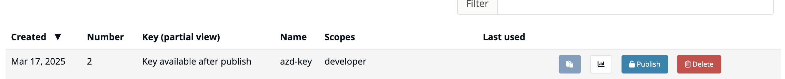
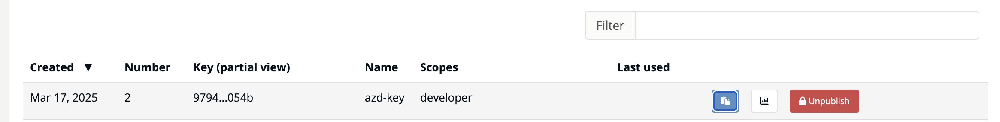
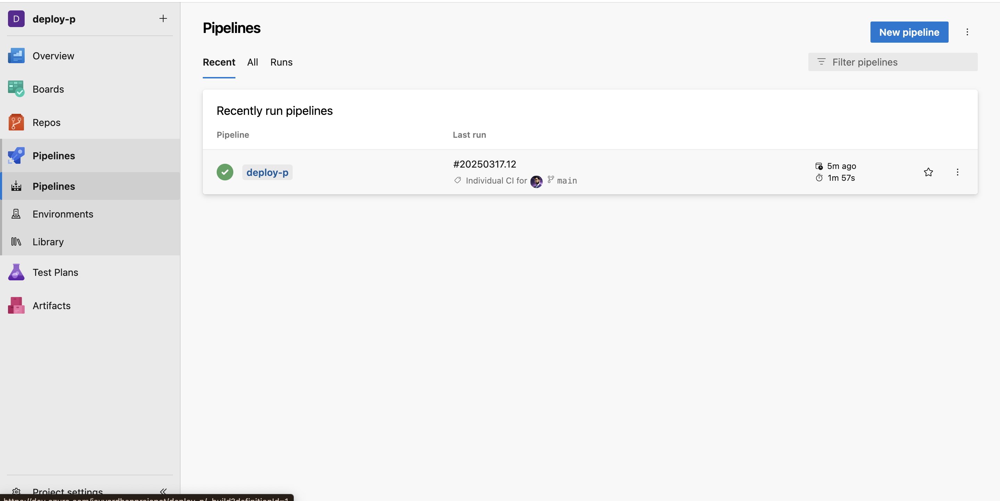
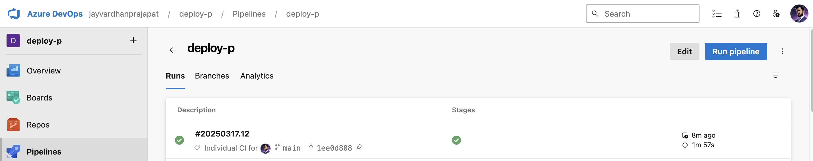
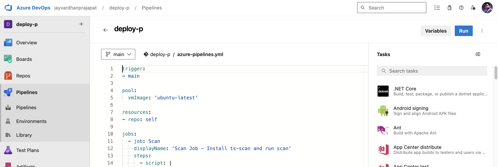
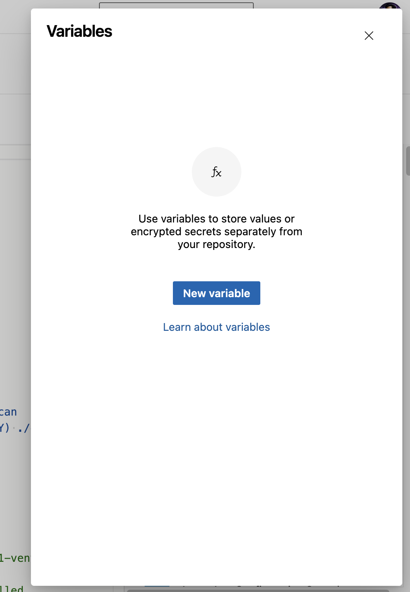
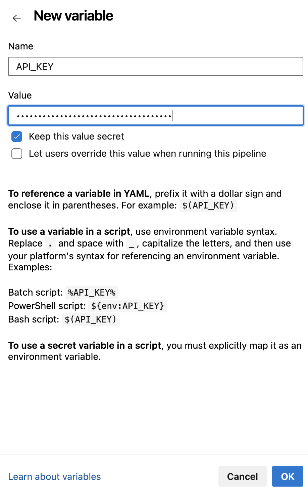

# Azure Pipeline Documentation

## Steps to Impelement ts-scan on Azure DevOps
- [Create an API Key on TrustSource](#Create-an-API-Key-on-TrustSource)
- [Azure DEVOPS Pipeline Breakdown](#AZURE-DEVOPS-Pipeline-Breakdown)
- [Prerequisites](#Prerequisites)
- [Setting Up Secret Variables](#Setting-Up-Secret-Variables)
- [Pipeline Code](#Pipeline-Code) 


## Create an API Key on TrustSource

To generate an API key for use in the Azure DevOps pipeline, follow these steps:

1. **Login to TrustSource and navigate to API-KEYS:**
   - Go to https://app.trustsource.io/settings/company/api/keys 

2. **Select API Keys:**
   - In the **Scanners & API keys** section, click on **API Keys**.
   

3. **Create a New API Key:**
   - Click on **Create Key** to generate a new API key.
   

4. **Name the Key and Select Scope:**
   - Enter a descriptive name for your API key.
   - Choose the appropriate **scope** for the API key based on your requirements.
   

5. **Publish and Copy the Key:**
   - After creating the key, make sure to **publish** it.
   - Copy the generated key and store it somewhere safe.



6. **Store the Key as a Secret Variable in Azure DevOps:**
   - Now that you have the API key, go to your Azure DevOps project and follow the steps to add it as a secret variable in your pipeline.


## AZURE DEVOPS Pipeline Breakdown

This Azure Pipeline automates the process of scanning the codebase using the `ts-scan` tool and uploading the results to a project. 

1. Installs the `ts-scan` package.
2. Runs a scan on the codebase.
3. Uploads the scan results to the specified project using a provided API key.

## Prerequisites

Before running this pipeline, ensure that the following requirements are met:

1. **Node.js Project:** If your project is Node.js-based, there must be a `package-lock.json` file in the root directory of the repository.

2. **API Key from TrustSource:** You will need to create an API key on TrustSource and store it as a secret variable in your Azure DevOps pipeline. See the **How to Create an API Key on TrustSource** section below for instructions.

### Steps

- **Install `ts-scan`:** Installs the specified version of the `ts-scan` package using `pip3`.
- **Run Scan:** Executes the scan command on the codebase and saves the output to `output-file.json`.
- **Upload Results:** Uploads the scan results to the specified project (`myproj`) using the `API_KEY` stored as a secret variable in Azure DevOps.

## Setting Up Secret Variables

In order to securely provide the `API_KEY` used in the pipeline, you'll need to set it as a secret variable in your Azure DevOps project. Follow these steps:

1. **Navigate to Azure DevOps Project:**
   Go to your Azure DevOps project where the pipeline is defined.


2. **Go to Pipeline Settings:**
   In the left navigation, select **Pipelines** and choose the pipeline you are working with.



3. **Edit Pipeline:**
   Click the **Edit** button on the top-right corner of the pipeline definition page.


4. **Access Variables:**
   In the pipeline editing page, select the **Variables** tab at the top.


5. **Add a New Variable:**
   - Click **+ Add** to create a new variable.

   - In the **Name** field, enter `API_KEY` (the name used in the pipeline).
   - In the **Value** field, enter your actual API key.
   - Check the **Keep this value secret** checkbox to ensure the value is encrypted and not exposed in logs.


6. **Save the Variable:**
   Click **Save** to save the secret variable.

7. **Save the Pipeline:**
   After configuring the secret variable, save the pipeline definition to apply the changes.


## Pipeline Code

```yaml
trigger:
- main

pool:
  vmImage: 'ubuntu-latest'

resources:
- repo: self

jobs:
  - job: Scan
    displayName: 'Scan Job - Install ts-scan and run scan'
    steps:
      - script: |
          echo "Installing ts-scan..."
          pip3 install ts-scan==1.0.4
          ts-scan scan --output output-file.json . --enable-deepscan
          ts-scan upload --project-name myproj --api-key $(API_KEY) ./output-file.json
        displayName: 'Install ts-scan and run scan'


